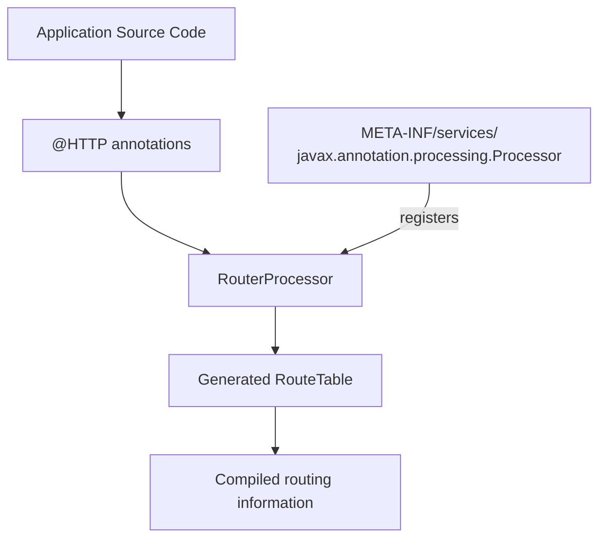
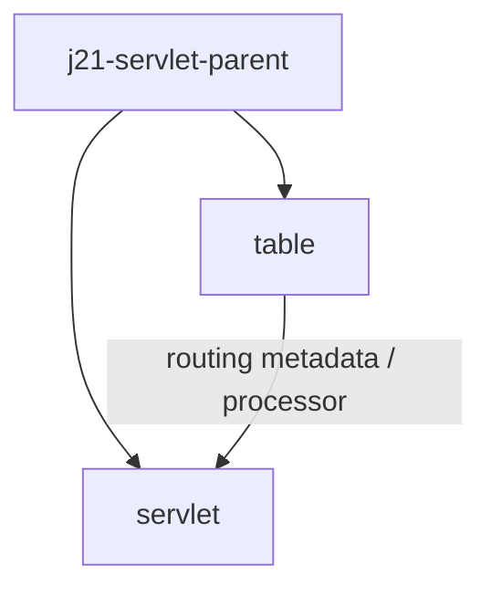
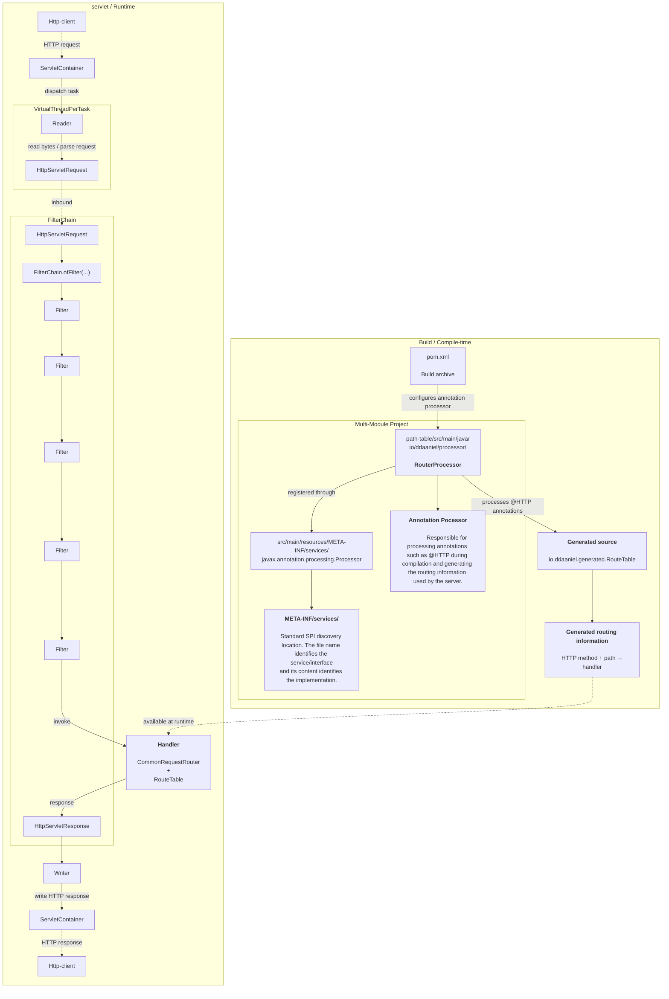
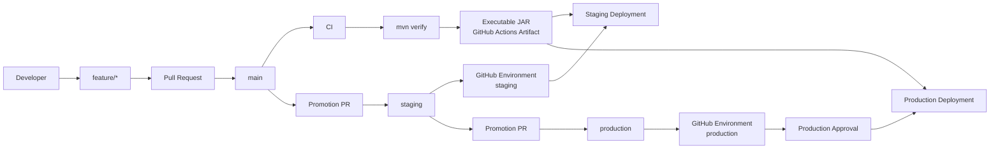

# J21-Servlet

> A humble HTTP server implementation built from the TCP layer up, exploring the
> internal mechanisms involved in HTTP request processing, routing,
> filtering, servlet abstractions and annotation processing.

---

## Table of Contents

- [Overview](#overview)
- [Goals](#goals)
- [Architecture](#architecture)
  - [High-Level Architecture](#high-level-architecture)
  - [Build-Time Architecture](#build-time-architecture)
  - [Runtime Architecture](#runtime-architecture)
  - [Request Lifecycle](#request-lifecycle)
- [Project Structure](#project-structure)
- [Modules](#modules)
  - [path-table](#path-table)
  - [server](#server)
- [Routing](#routing)
  - [@HTTP](#http)
  - [Annotation Processing](#annotation-processing)
  - [Generated RouteTable](#generated-routetable)
  - [Service Provider Interface](#service-provider-interface)
- [Runtime Components](#runtime-components)
  - [ServletContainer](#servletcontainer)
  - [Reader](#reader)
  - [HttpServletRequest](#httpservletrequest)
  - [FilterChain](#filterchain)
  - [Handler](#handler)
  - [Writer](#writer)
  - [HttpServletResponse](#httpservletresponse)
- [Build Lifecycle](#build-lifecycle)
- [Testing](#testing)
  - [Unit Tests](#unit-tests)
  - [Integration Tests](#integration-tests)
  - [Load Testing](#load-testing)
- [Running Locally](#running-locally)
- [Building the Project](#building-the-project)
- [Generated Artifacts](#generated-artifacts)
- [CI/CD](#cicd)
  - [Branch Flow](#branch-flow)
  - [Continuous Integration](#continuous-integration)
  - [Staging](#staging)
  - [Production](#production)
- [Development Workflow](#development-workflow)
- [Design Decisions](#design-decisions)
- [Performance](#performance)
- [Known Limitations](#known-limitations)
- [Future Work](#future-work)
- [Troubleshooting](#troubleshooting)
- [Contributing](#contributing)
- [License](#license)

---

# Architecture

## High-Level Architecture

The project can be divided into two major phases:

```text
┌──────────────────────────────────────────────────────────────┐
│                        BUILD TIME                            │
│                                                              │
│  @HTTP annotations                                           │
│        │                                                     │
│        ▼                                                     │
│  RouterProcessor                                             │
│        │                                                     │
│        ▼                                                     │
│  Generated RouteTable                                        │
│                                                              │
└──────────────────────────────┬───────────────────────────────┘
                               │
                               │ generated artifact
                               ▼
┌──────────────────────────────────────────────────────────────┐
│                         RUNTIME                              │
│                                                              │
│  HTTP Client                                                 │
│       │                                                      │
│       ▼                                                      │
│  ServletContainer                                             │
│       │                                                      │
│       ▼                                                      │
│  Reader                                                       │
│       │                                                      │
│       ▼                                                      │
│  HttpServletRequest                                           │
│       │                                                      │
│       ▼                                                      │
│  FilterChain                                                  │
│       │                                                      │
│       ▼                                                      │
│  Handler / Router                                             │
│       │                                                      │
│       ▼                                                      │
│  HttpServletResponse                                          │
│       │                                                      │
│       ▼                                                      │
│  Writer                                                       │
│       │                                                      │
│       ▼                                                      │
│  ServletContainer                                             │
│       │                                                      │
│       ▼                                                      │
│  HTTP Client                                                  │
│                                                              │
└──────────────────────────────────────────────────────────────┘
````

The important architectural boundary is:

> Route discovery happens at compile time; route execution happens at
> runtime.

---

# Build-Time Architecture

During compilation, the annotation processor scans application classes for
the `@HTTP` annotation.



The annotation processor is therefore part of the build process and does not
participate directly in processing HTTP requests.

---

# Runtime Architecture


---

# Request Lifecycle

A complete request follows approximately this lifecycle:

```text
1. Client establishes TCP connection
                 │
                 ▼
2. ServletContainer accepts connection
                 │
                 ▼
3. A task is dispatched
                 │
                 ▼
4. Reader consumes bytes from SocketChannel
                 │
                 ▼
5. HTTP request is parsed
                 │
                 ▼
6. HttpServletRequest is created
                 │
                 ▼
7. FilterChain is executed
                 │
                 ▼
8. Filters process inbound request
                 │
                 ▼
9. Handler resolves the route
                 │
                 ▼
10. Application handler executes
                 │
                 ▼
11. HttpServletResponse is populated
                 │
                 ▼
12. Filters process outbound response
                 │
                 ▼
13. Writer serializes the response
                 │
                 ▼
14. ServletContainer writes to SocketChannel
                 │
                 ▼
15. HTTP response reaches the client
```

---

# Project Structure

```text
.
├── .github/
│   └── workflows/
│       ├── ci.yml
│       ├── staging.yml
│       └── production.yml
│
├── .mvn/
│
├── excalidraw/
│
├── path-table/
│   ├── src/
│   │   ├── main/
│   │   │   ├── java/
│   │   │   │   └── io/ddaaniel/
│   │   │   │       ├── annotations/
│   │   │   │       └── processor/
│   │   │   │           └── RouterProcessor.java
│   │   │   │
│   │   │   └── resources/
│   │   │       └── META-INF/
│   │   │           └── services/
│   │   │               └── javax.annotation.processing.Processor
│   │   │
│   │   └── test/
│   │
│   └── pom.xml
│
├── server/
│   ├── src/
│   │   ├── main/
│   │   │   └── java/
│   │   │       └── io/ddaaniel/
│   │   │           ├── core/
│   │   │           ├── listener/
│   │   │           ├── servlet/
│   │   │           ├── filter/
│   │   │           ├── router/
│   │   │           ├── user/
│   │   │           └── generated/
│   │   │
│   │   └── resources/
│   │
│   ├── integration/
│   │   ├── python/
│   │   │   ├── requirements.txt
│   │   │   └── test_servlet.py
│   │   │
│   │   └── run.py
│   │
│   └── pom.xml
│
├── pom.xml
│
└── README.md
```

> That package structure may change over the time as the implementation grows.
> However this section in theory should be updated whenever an module is added,
> removed or renamed.

---

# Modules

The project follows a Maven multi-module architecture.



---

## table

`table` contains the compile-time routing infrastructure.

This module is responsable for define the annotations related
to routing, implement its processors, construct the routing information
and exposing the annotation processors through Java SPI.
For while the main component still being: `io.ddaaniel.processor.RouterProcessor`

---

## servlet

`servlet` contains the HTTP server runtime.

Module responsable for to treat with socket opening, accepting,
manage each task that contain a specific request, read data,
create httpObjects, consult the request destination on the service
provide by the table module and write on the respective socket the response.

---

# Routing

The routing mechanism is intentionally split into two phases:

```text
             BUILD TIME
                  │
                  ▼
        ┌──────────────────┐
        │   @HTTP methods  │
        └────────┬─────────┘
                 │
                 ▼
        ┌──────────────────┐
        │ RouterProcessor  │
        └────────┬─────────┘
                 │
                 ▼
        ┌──────────────────┐
        │   RouteTable     │
        └────────┬─────────┘
                 │
═════════════════╪══════════════════
                 │
              RUNTIME
                 │
                 ▼
        ┌──────────────────┐
        │ CommonRequest    │
        │ Router           │
        └──────────────────┘
```

---

# @HTTP

Application endpoints are declared through the `@HTTP` annotation.

Example:

```java
@HTTP(method = "GET", path = "/")
public void index(...) {
    // ...
}
```

Another example:

```java
@HTTP(method = "GET", path = "/stream")
public void stream(...) {
    // ...
}
```

The annotation provides the metadata required by the routing system.
For while just one type of request :(

---

# Annotation Processing

The `RouterProcessor` is a Java annotation processor.
As you could assume it process annotations, but specifically 
annotation that I declare / create  on the directory 
`j21-servlet/table/src/main/java/io/ddaaniel/annotations`.

Conceptually:

```text
Java compiler
     │
     ▼
Annotation Processor
     │
     ├── discover @HTTP
     │
     ├── inspect method/class metadata
     │
     └── generate source
             │
             ▼
        RouteTable.java
```


---

# Generated RouteTable

The processor generates `io.ddaaniel.generated.RouteTable`,
that class represents the compiled routing table.
The idea is resolve the request destination ( resource path )
without reflections, whitch was my first thought.

Conceptually:

```text
HTTP method + path
        │
        ▼
┌─────────────────────────────┐
│        RouteTable           │
├─────────────────────────────┤
│ GET /                       │
│ GET /stream                 │
│ GET /myproblem              │
│ GET /videoStream            │
└─────────────────────────────┘
```

---

# Service Provider Interface

The annotation processor is registered using Java's Service Provider
mechanism. Whose registration file is something like this  
`META-INF/services/javax.annotation.processing.Processor` and its 
content identifies some implementation like `io.ddaaniel.processor.RouterProcessor`

Conceptually:

```text
javax.annotation.processing.Processor
                    │
                    │ implemented by
                    ▼
          RouterProcessor
                    ▲
                    │ discovered through
                    │
        META-INF/services/
                    │
                    ▼
javax.annotation.processing.Processor
```

Important educational Note the `META-INF/services` file is a
**service registration mechanism**. It means that declares
which implementation is available for a service interface.

And for future thoughts this mechanism is conceptually related to 
`ServiceLoader.load(...)`, class that when used on your code 
utiliza-se the reflections to dynamically load or discover ( I personaly
forgot the term used... ) our SPI, boooo!

In some researchs that "I" made, on annotation processors, they also
make that discover dynamically ( By his on way of course... ), but how it is
an annotation processor what ever it performs is in compile-time, or 
being more right not in runtime, so Yay!

---


# Testing

For unit-tests:

```bash
mvn test
```

A specific test can be executed with:

```bash
mvn test -Dtest=TestClass
```

---

For integration tests:

```text
server/integration/run.py
```

If Im not wrong, To run both unit and integration:

```text
mvn verify
```

---

# Requirements

The project currently targets:

```text
Java 21
Maven
Python 3
pytest
```

Check Java:

```bash
java -version
```

Check Maven:

```bash
mvn -version
```

Check Python:

```bash
python --version
```

---

# Building the Project

Build everything:

```bash
mvn verify
```

Compile without running the complete verification lifecycle:

```bash
mvn compile
```

Run unit tests:

```bash
mvn test
```

Package the application:

```bash
mvn package
```

---

# Running the Server

After packaging:

```bash
java -jar server/target/server-1.0-SNAPSHOT.jar
```

The server listens on:

```text
127.0.0.1:42069
```

Test it with:

```bash
curl http://127.0.0.1:42069/
```

---


### Motivation

Runtime reflection-based discovery would require the application to inspect
classes and methods during runtime. And I don't like it! Simple as that !

---

Other Flattering relative to other techs useds on this project includes 
Virtual Threads ( available only on Java 21 ) which he played a role in
making possible process more than one request at a time. ( It should be
decoupled later ... ).
Java NIO, which is the candidate to be an alternative to Virtual Threads.

--- 


The following areas may still be incomplete or evolving:

* HTTP protocol coverage;
* malformed request handling;
* connection lifecycle management;
* HTTP/1.1 edge cases;
* persistent connections;
* request-body streaming;
* response streaming;
* timeout handling;
* backpressure;
* graceful shutdown;
* resource management;
* production deployment infrastructure;
* observability;
* metrics;
* TLS;
* HTTP/2;
* HTTP/3.


---


# AIB Appendix A — Complete Architecture



---

# AIB Appendix B — Architectural Boundaries

The system can be understood as a sequence of boundaries:

```text
┌────────────────────────────────────────────────────┐
│                    NETWORK                         │
│                                                    │
│ ServerSocketChannel / SocketChannel                │
└───────────────────────┬────────────────────────────┘
                        │
                        ▼
┌────────────────────────────────────────────────────┐
│                    HTTP                            │
│                                                    │
│ bytes → HTTP message → request/response            │
└───────────────────────┬────────────────────────────┘
                        │
                        ▼
┌────────────────────────────────────────────────────┐
│                  SERVLET                           │
│                                                    │
│ HttpServletRequest / HttpServletResponse            │
└───────────────────────┬────────────────────────────┘
                        │
                        ▼
┌────────────────────────────────────────────────────┐
│                  FILTER                            │
│                                                    │
│ FilterChain                                       │
└───────────────────────┬────────────────────────────┘
                        │
                        ▼
┌────────────────────────────────────────────────────┐
│                  ROUTING                           │
│                                                    │
│ CommonRequestRouter / RouteTable                   │
└───────────────────────┬────────────────────────────┘
                        │
                        ▼
┌────────────────────────────────────────────────────┐
│                APPLICATION                         │
│                                                    │
│ User controllers / handlers                        │
└────────────────────────────────────────────────────┘
```

---

# AIB Appendix C — Build vs Runtime

One of the fundamental architectural concepts of the project is the
separation between build-time and runtime responsibilities.

| Responsibility              | Phase   |
| --------------------------- | ------- |
| Read `@HTTP` annotations    | Build   |
| Discover endpoint metadata  | Build   |
| Generate `RouteTable`       | Build   |
| Compile Java sources        | Build   |
| Package executable JAR      | Build   |
| Accept TCP connections      | Runtime |
| Read request bytes          | Runtime |
| Parse HTTP request          | Runtime |
| Execute filters             | Runtime |
| Resolve route               | Runtime |
| Execute application handler | Runtime |
| Serialize response          | Runtime |
| Write response to socket    | Runtime |

This separation is one of the central architectural concepts of `j21-servlet`.

---

# AIB Appendix D — CI/CD Artifact Flow



The artifact generated by CI is the unit that moves through the deployment
pipeline.

The source branch changes, but the executable artifact should not be rebuilt
merely because it is being promoted to another environment.

---

## Glossary

| Term | Definition | Context in the project |
|---|---|---|
| **AIB** | Artificial Intelligence Bulshit | Bulshit produced or recommended by AI  |

---

# AIB Appendix E — Useful Commands

## Full verification

```bash
mvn verify
```

## Clean build

```bash
mvn clean verify
```

## Unit tests

```bash
mvn test
```

## Package

```bash
mvn package
```

## Run executable

```bash
java -jar server/target/server-1.0-SNAPSHOT.jar
```

## Test endpoint

```bash
curl http://127.0.0.1:42069/
```

## Check listening socket

```bash
ss -ltnp | grep 42069
```

## Load test

```bash
wrk -t12 -c400 -d30s --latency \
    http://localhost:42069/
```

## Git branches

```bash
git branch
```

## Push feature branch

```bash
git push -u origin feature/<name>
```

---

# AIB Appendix F — Mental Model

The entire project can be reduced to the following mental model:

```text
                       SOURCE CODE
                            │
                            ▼
                       @HTTP
                            │
                            ▼
                  ┌─────────────────┐
                  │ RouterProcessor │
                  └────────┬────────┘
                           │
                           ▼
                     RouteTable
                           │
                           │
═══════════════════════════╪════════════════════════════
                           │
                        RUNTIME
                           │
                           ▼
                     TCP connection
                           │
                           ▼
                   SocketChannel
                           │
                           ▼
                        Reader
                           │
                           ▼
                 HttpServletRequest
                           │
                           ▼
                     FilterChain
                           │
                           ▼
                        Handler
                           │
                           ▼
                     RouteTable
                           │
                           ▼
                 Application Handler
                           │
                           ▼
                HttpServletResponse
                           │
                           ▼
                        Writer
                           │
                           ▼
                   SocketChannel
                           │
                           ▼
                    HTTP Client
```

The central architectural idea is therefore:

> **Compile the knowledge of the application routes once, then use that
> compiled information while processing HTTP requests.**

````
